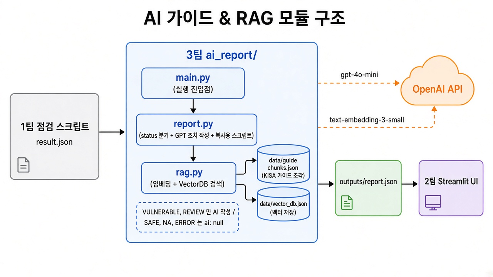

# module2_project

KISA 주요정보통신기반시설 가이드 기반 리눅스 서버 점검 보고서 AI 자동화



## 팀별 작업 폴더

| 팀  | 역할                           | 폴더         |
| --- | ------------------------------ | ------------ |
| 1팀 | 점검 스크립트 → 결과 JSON 생성 | `scanner/`   |
| 2팀 | 환경구성, Streamlit UI         | `ui/`        |
| 3팀 | AI 가이드 & RAG (보고서 생성)  | `ai_report/` |

자기 팀 폴더만 수정합니다. 공용 파일: `requirements.txt`, `.env`(API 키)

---

## 1팀 - 점검 스크립트 (`scanner/`)

> 1팀이 작성해 주세요.

- 역할:
- 실행 방법:
- 결과물: `result.json` (3팀에 전달)

---

## 2팀 - 환경구성 & UI (`ui/`)

> 2팀이 작성해 주세요.

- 역할:
- 실행 방법:
- 3팀 연동: 아래 "3팀" 의 `generate_report` 를 호출해 `report` 를 화면에 표시

---

## 3팀 - AI 가이드 & RAG (`ai_report/`)

점검 결과 중 **취약·수동확인 항목**에 대해 KISA 가이드를 찾아(RAG) GPT가 조치 방법을 작성합니다.

### 실행 (최상위 폴더에서)

```bash
python -m venv .venv
.venv\Scripts\activate            # Windows (Git Bash: source .venv/Scripts/activate / Mac·Linux: source .venv/bin/activate)
pip install -r requirements.txt
```

최상위 폴더에 `.env` 파일을 만들고 `OPENAI_API_KEY=공유받은키` 를 넣습니다.

```bash
python -m ai_report.main                 # 샘플(ai_report/data/result.json)로 실행
python -m ai_report.main 파일경로.json    # 다른 점검 결과로 실행
```

결과: `ai_report/outputs/report.json`

### 입력 → 처리 (`status` 별)

| status                 | 처리                      |
| ---------------------- | ------------------------- |
| `VULNERABLE`, `REVIEW` | AI가 조치 작성            |
| `SAFE`, `NA`, `ERROR`  | 그대로 전달 (`ai` = null) |

### 출력 (`report`)

```python
from ai_report.report import generate_report

report = generate_report(점검결과_dict)   # 취약·수동확인 항목 수만큼 GPT 호출 → 시간이 걸림
```

- `target_info`, `diagnosis_standard`, `summary` : 1팀 값 그대로
- `items[]` : 1팀 항목 그대로 + 아래 3개
  - `ai` : `{risk, remediation_steps, commands, verification, caution}` (GPT 응답 그대로라 일부 키가 빠질 수 있음)
  - `guide_used` : 근거로 쓴 가이드 원문
  - `error` : AI 작성 실패 사유 (정상이면 `""`)
### 가이드 데이터

`ai_report/data/guide_chunks.json` — 현재는 AI 작성 **초안**이며 KISA 원문 전처리 결과로 교체 예정.
수정하면 다음 실행 때 벡터DB(`vector_db.json`)가 자동으로 다시 만들어집니다.

```json
[{ "item_code": "U-01", "section": "조치방법", "text": "가이드 내용..." }]
```
